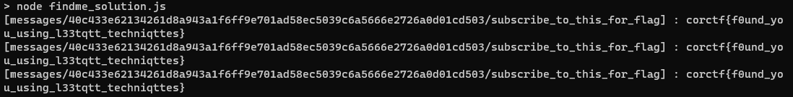

# findme
web // ehhthing // 2021 corCTF

## Setup

We are given a messaging application that connects to a backend pub/sub broker using the [MQTT pub/sub protocol](http://docs.oasis-open.org/mqtt/mqtt/v3.1.1/os/mqtt-v3.1.1-os.html).  The broker is implemented using [aedes](https://github.com/moscajs/aedes), and we're provided the source of the `authorizeSubscribe` and `authorizePublish` overrides.  `authorizeSubscribe` is as follows:

```js
aedes.authorizeSubscribe = (client, sub, callback) => {
	let topic = sub.topic;

	if ((topic.startsWith('messages/') && !topic.startsWith('messages/' + client.id)) || 
		(topic.startsWith('errors/') && !topic.startsWith('errors/' + client.id)) || 
		topic.includes('+') ||
		topic.includes('#')) {
		// MQTT 5.0 not supported, so to provide feedback we need to publish a message :(
		aedes.publish({
			topic: 'errors/' + client.id,
			payload: 'invalid subscribe packet ' + JSON.stringify(sub)
		});

		return callback(new Error('invalid subscribe packet'));
	}


	callback(null, sub);
}
```

Comparing this source to the MQTT protocol spec and the flavor text ("i learned mqtt and made a cool chat app with it. it's so secure i bet you can't find me on it") we can make a few observations:
* Wildcards are not allowed, so we can't just go read every message channel at once.
* We're probably looking to find the admin's user id to subscribe to their message channel.  The website has a big red button to call the admin, which presumably causes an admin client to connect and start publishing the flag on their secret message channel.
* Clients are allowed to subscribe to message and errors channels for other clients, as long as your client id is a prefix of theirs.
* MQTT (as a convention) reserves topics beginning with $SYS for debug information.  We are allowed to subscribe to these, or any non-message non-error channels, at will.

Looking through the aedes source code, we find that the broker will announce all subscriptions on the system topic $SYS/\<broker-id\>/new/subscribes.  If we could subscribe to that topic, we'd probably be able to catch the admin coming online.  However, the broker id is by default a UUIDv4 which is not announced in any handshake packets.  Our goal is to somehow obtain it.

## Obtaining the broker id

Looking again through the aedes source, we find that aedes uses a different packet structure, the [aedes-packet](https://github.com/moscajs/aedes-packet/), which is sometimes populated with the broker id of the aedes instance that's serving the packet.  However, the stream writer coerces this to a standard MQTT packet, which drops the broker id.  Therefore we need to get the packet object during its processing by aedes.

Looking again at the challenge source code, we notice that in the event of an invalid publish or subscribe attempt, aedes will directly call `publish` with a payload containing the stringified packet, which could potentially contain the broker id.  However, under normal circumstances, `authorizePublish` and `authorizeSubscribe` are called very early in the respective publish and subcribe lifecycles.  So we need to look for a path where one of the two is called later in the packet lifecycle.  MQTT contains two mechanisms for special packet handling that might cause this:
* Retained publish packets.  These are saved ("retained") to a particular topic, so when clients subscribe to that topic, they are immediately sent the retained message.
* Last will.  This is a packet that a client can provide upon connection to the server which is sent if and only if the client disconnects abruptly.

Examining the source or using the provided hint ("HINT: secure until death do us part"), we find that the last will exhibits the desired behavior.

From [aedes/lib/handlers/connect.js](https://github.com/moscajs/aedes/blob/main/lib/handlers/connect.js#L194):
```js
function storeWill (arg, done) {
  const client = this.client
  client.will = client._will
  // delete any existing will messages from persistence
  client.broker.persistence.delWill(client, function () {
    if (client.will) {
      client.broker.persistence.putWill(
        client,
        client.will,
        done)
    } else {
      done()
    }
  })
}
```

aedes calls into [aedes-persistence](https://github.com/moscajs/aedes-persistence/blob/master/persistence.js#L296) to store the will:

```js
MemoryPersistence.prototype.putWill = function (client, packet, cb) {
  packet.brokerId = this.broker.id
  packet.clientId = client.id
  this._wills[client.id] = packet
  cb(null, client)
}
```

Bingo!  The broker id is set on the packet and it's not yet sent.  When a client has an abrupt disconnection, [the will is sent as follows](https://github.com/moscajs/aedes/blob/main/lib/client.js#L294):

```js
  function finish () {
    const will = that.will
    // _disconnected is set only if client is disconnected with a valid disconnect packet
    if (!that._disconnected && will) {
      that.broker.authorizePublish(that, will, function (err) {
        if (err) { return done() }
        that.broker.publish(will, that, done)

        function done () {
          that.broker.persistence.delWill({
            id: that.id,
            brokerId: that.broker.id
          }, noop)
        }
      })
    }
```

So `authorizePublish` will be called on the will packet _after_ the broker id is set, as desired.

## Exploit chain

First, we need to generate an appropriate will.  The payload of the will doesn't matter, but its topic ought to be something that the client is expressly NOT allowed to publish to.  Clients aren't allowed to publish to any non-message topic, so just some foobar topic will work.  We also need to be able to catch the broker's error feedback on the appropriate error channel.  If client1 is presenting the will, then the error feedback will be broadcast to errors/\<client1.id\>.  So we need to have a client0 that stays connected and is allowed to subscribe to this channel.  Thus it suffices for the client0, the one that survives, to have a client id that's a prefix of the client1's id.  Note that although the web interface we're given will randomly generate client ids, in fact we can provide whatever we want when doing this ourselves.  The flow is as follows:

* connect client0 with id `zwnj0`
* subscribe to `errors/zwnj00`
* generate a will packet `will`
* connect client1 with id `zwnj00` and will packet `will`
* force-disconnect client1


Subscribing to `$SYS/e273cbbe-a7e5-4d3a-a765-811857ecdf0a/new/subscribes` and then calling the admin from the web interface shows the following message:


Subscribing to that topic as instructed gives the flag, `corctf{f0und_you_using_l33tqtt_techniqttes}`

