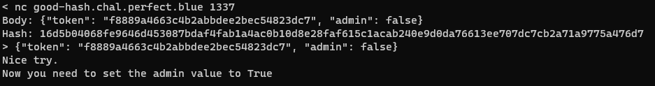
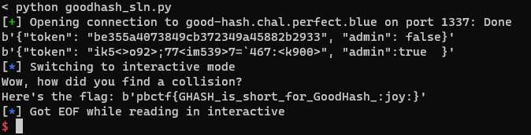

# GoodHash
crypto // rbtree // 2021 pbctf

## Setup
The challenge is presented as a client-server interaction where we are ostensibly asked to find a hash collision.  However, there are two unusual parts to the hash procedure - the _structure_ and _usage_ of the hash function inputs.

The server first generates a 16-byte token on the backend.  However, this token isn't used in a traditional way - it's encoded via hex representation into stringified JSON, together with a flag indicating whether the token is "admin".  For example:

`'{"token": "0123456789abcdef0123456789abcdef", "admin": false}'`

This string (the "token body" as the challenge calls it) is encoded via utf-8 and fed into the hash function as a bytestring.  It's also printed out so we know what the random bytes are.

Hashing is done via AES-GCM, but in an unconventional way:

 - The key is fixed and known: `b'goodhashGOODHASH'`.
 - The plaintext is also fixed and known.  It's a zero-byte string of length 32.
 - The _nonce_ is the above "token body", which is the only variable input.

After hashing the token body, the server asks us for a string, which it will hash in the same way as above and compare for a collision.  Of course we can provide the exact token body provided to us, but when we try that:

So we need a string that will give the same result in the hash procedure, but also can be loaded as valid JSON to an object with key `"admin"` and value `true`.

## Investigating the hash procedure

The first step is to understand exactly what happens to the nonce input in AES-GCM.  That's the only input that we may modify, or that gets modified at all, in our quest to produce a collision.  We can consult either the [NIST spec](https://nvlpubs.nist.gov/nistpubs/legacy/sp/nistspecialpublication800-38d.pdf) or the [pycryptodome source code](https://github.com/Legrandin/pycryptodome/blob/master/lib/Crypto/Cipher/_mode_gcm.py#L180).

In either case, we see that the nonce input (referred to in the NIST spec as the IV) is first used to generate an intermediate block `J0`.  The nonce isn't used for anything other than computing `J0`.  So if we can find a collision in the procedure used to compute `J0`, then that will suffice to produce a collision in the overall hash procedure (recall that the other inputs to the hash procedure are fixed).  The procedure is as follows:

* Pad the nonce with zero bytes until its length is a multiple of 16 bytes, then add 8 more zero bytes, followed by an 8-byte chunk with value equal to the length of the original nonce.
* The resulting padded nonce will be a multiple of the block length (16 bytes or 128 bits).
* Compute a _hash subkey_, also referred to as `H`, by encrypting a zero block with AES in ECB mode and the key (`b'goodhashGOODHASH'`).  Note that `H` is not random and we can determine what it is.
* Compute `GHASH` using the hash subkey `H` and input the padded nonce.

(note: a different procedure is used when the nonce is length exactly 96 bits, but in our case the "token body" is 61 bytes)

`GHASH` is a component function defined in the AES-GCM spec as follows:

* Interpret the hash subkey `H` in _little-endian_ form as a member of `GF(2^128)`, the Galois Field used for GCM arithmetic.
* Split the input into blocks `X1, X2, ... , Xm`.
* For each block `Xi`, interpret it in `GF(2^128)` as well.
* Multiply in `GF(2^128)` each block `Xi` by `H^(m+1-i)`, where `H` is the hash subkey.
* Sum the results, either by summation in `GF(2^128)` or by xor-ing the integer representations.  The two are requivalent.
* Return the result.

`GHASH` is highly malleable.  In particular, it's linear in the input blocks, so we will be able to produce collisions in it.

## Collisions in `GHASH`

To see why we can easily manufacture collisions in `GHASH`, consider a hypothetical two-block input (instead of our padded nonce which will have 5 blocks).

Let the blocks of our input be `X1` and `X2`.  Then the `GHASH` output is `X1 * H^2 + X2 * H` (operations in `GF(2^128)`).  If we want to transform `X2` to a related plaintext `X2'`, then if we have control over `X1`, we can also transform it to `X1'` by solving:

`X1 * H^2 + X2 * H = X1' * H^2 + X2 * H`

`(X1' - X1) * H^2 = (X2 - X2') * H`

`X1' - X1 = (X2 - X2') * H^-1`

`X1' = X1 + (X2 - X2') * H^-1`

We can use this tactic on our padded nonce which has 5 blocks, of which 4 have some portion we can control:

`'{"token": "0123456789abcdef0123456789abcdef", "admin": false}'`

1. `b'{"token": "01234'`

2. `b'56789abcdef01234'`

3. `b'56789abcdef", "a'`

4. `b'dmin": false}\x00\x00\x00'`

5. Entirely padding, plus the length of the nonce.  We should take care to not modify the length of the unpadded nonce so that this block does not change.

There are multiple approaches from here, but the one that makes the minimal modification to the token structure is to change the 4th block from `false` to `true`.  For our purposes, we can normalize the value of `GHASH` by dividing by `H^2`, so that the _target difference_ in the `GHASH` output is just the xor of `b'dmin": false}\x00\x00\x00'` with `b'dmin":true  }\x00\x00\x00'`.

Changing any bit in the remaining blocks will produce a related change in the overall value of `GHASH`.  For example, flipping the leftmost bit of the 3rd block will result in `H` being added to the value (recall that the bitstring is interpreted in little-endian).  Flipping the rightmost bit of the 2nd block will result in `2^127 * H^2` being added.  So on and so forth.

As we are manipulating the nonce, we need to ensure that it's still valid JSON at the end of the day.  The simplest way to do this is to only modify the contents of the "token" value, which is a 32-byte string.  As long as we only modify the lower 4 bits of each byte, it's pretty likely to remain printable ASCII and won't ever include the double quote character.  That still gives us 128 bits of flexibility, which will let us achieve most `GHASH` target differences, as the output is also 1 block = 128 bits.

## Exploit

The next step is to precompute an xor mask that only affects the lower 4 bits of those 32 bytes corresponding to the "token" string, whose value in `GHASH` is equal to the target difference.  The only values we need to know are the target difference and `H`, so this can be done entirely offline, but the computation turns out to be fast enough that it could have easily run online.

We construct a 128 by 128 matrix `M` in `GF(2)` to represent this as a system of equations.  For each bit that we control over in the first three blocks, we take the `GF(2^128)` product of `2^k`, where `k` is the little-endian bit position within its block, with `H^n`, where `n` is 3 for the first block, 2 for the second block, and 1 for the third block.  The product is then converted to an integer representation and its binary digits become a row of the equation matrix.

The resulting matrix actually doesn't turn out to be full rank for some reason, but it's really close.  This is the reason why the target 4th block is `b'dmin":true  }'` with that whitespace.  A slight massage was all that was needed to get the matrix equation to solve.  In any case, if we needed more rank, we could have also edited the key name "token".

Letting `d` be the `GF(2)` vector corresponding to the binary digits of the `GHASH` target difference, solving the matrix equation `aM = d` gives us the required values of the bits in the xor mask.  We represent the xor mask as three integers, one per block.

All that's left is to actually perform the interaction.  We get a token, xor its first three blocks with the respective masks, and add `b'dmin":true  }'` at the end.  Submitting that text gives the flag, `pbctf{GHASH_is_short_for_GoodHash_:joy:}`.

